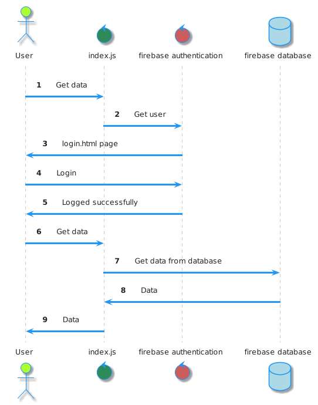
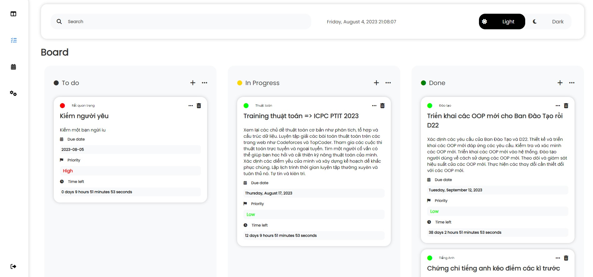
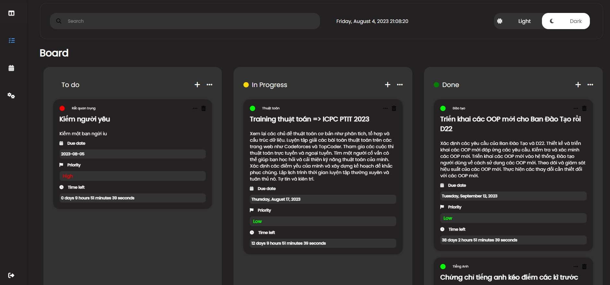
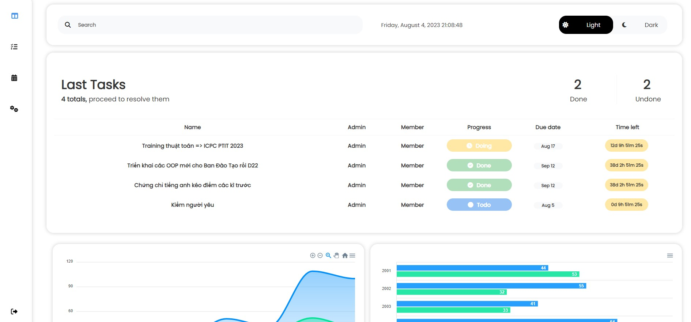

# CyouTodo

Demo: https://todo.quochung.cyou

## Author

* quochungcyou

## Project Structure
    

    ├── index.html - Trang hiển thị task
    ├── README.md
    ├── login.html - Trang đăng nhập đawng kí
    ├── dashboard.html - Trang dashboard
    ├── LICENSE - Giấy phép sử dụng
    ├── asset
    │   ├── css
    │   │   ├── index.css - CSS chung cho index/dashboard
    │   │   ├── login.css - CSS cho login
    │   │   ├── lightdarkmode.css - CSS cho phần bật sáng tối
    │   │   ├── preload.css - CSS cho phần loader
    |   ├── js
    │   │   ├── index.js - JS chung cho index
    │   │   ├── login.js - JS cho login
    │   │   ├── lightdarkmode.js - JS cho phần bật sáng tối
    │   │   ├── dashboard.js - JS cho phần dashboard
    |   ├── img Lưu ảnh của project


## Sequence Diagram




## Description

* Web bài tập lớn Team Web ProPTIT D21
* Đề tài: CyouTodo - Ứng dụng quản lý công việc cá nhân
* Phần chính là FrontEnd


## Demo image





## Feature
- [x] Đăng nhập/Đăng ký
- [x] Thêm/Xoá/Sửa công việc
- [x] Light/Dark mode
- [x] Đếm ngược thời gian công việc
- [x] Hiển thị thời gian còn lại, mức độ quan trọng
- [ ] Thống kê công việc, lịch
- [ ] Cài đặt tài khoản


## Prerequisites and Setup

* JavaScript
* JQuery
* HTML/CSS (Pure CSS)
* Firebase for hosting/realtime database
* ApexChart (JS) - Just for demo


## License Information

* This software is licensed under MIT License.
* [Read More](https://choosealicense.com/licenses/mit/) on the license.

### Giúp đỡ tôi bằng cách chia sẻ hoặc tặng sao


### Thông tin liên hệ 

> Nếu có bất kỳ nội dung nào liên quan còn thiếu，hãy tạo [issues](https://github.com/quochung-cyou/QLDT_Enhancer/issues) cho nó, tôi sẽ theo dõi và cải thiện。

```
MIT License

Copyright (c) 2023 QuocHung

Permission is hereby granted, free of charge, to any person obtaining a copy
of this software and associated documentation files (the "Software"), to deal
in the Software without restriction, including without limitation the rights
to use, copy, modify, merge, publish, distribute, sublicense, and/or sell
copies of the Software, and to permit persons to whom the Software is
furnished to do so, subject to the following conditions:

The above copyright notice and this permission notice shall be included in all
copies or substantial portions of the Software.

THE SOFTWARE IS PROVIDED "AS IS", WITHOUT WARRANTY OF ANY KIND, EXPRESS OR
IMPLIED, INCLUDING BUT NOT LIMITED TO THE WARRANTIES OF MERCHANTABILITY,
FITNESS FOR A PARTICULAR PURPOSE AND NONINFRINGEMENT. IN NO EVENT SHALL THE
AUTHORS OR COPYRIGHT HOLDERS BE LIABLE FOR ANY CLAIM, DAMAGES OR OTHER
LIABILITY, WHETHER IN AN ACTION OF CONTRACT, TORT OR OTHERWISE, ARISING FROM,
OUT OF OR IN CONNECTION WITH THE SOFTWARE OR THE USE OR OTHER DEALINGS IN THE
SOFTWARE.
```
