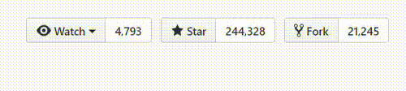

# Thông tin

Tài liệu chuẩn bị các buổi phục vụ cho Team Web trong khoá D21 của CLB Lập Trình PTIT.

## Truy cập: [Tổng quan tài liệu](https://quochung-cyou.github.io/WebDocument/) 

# Trong Repo này gồm có

- ✅ Tài liệu chuẩn bị cho các buổi phục vụ
- ✅ Tài liệu tham khảo
- ✅ Tài liệu hướng dẫn

## Các phần học:

- [✅ Buổi 1: Lý thuyết cơ bản về web, HTML cơ bản](./Buoi1/README.md). 

### Giúp đỡ tôi bằng cách chia sẻ hoặc tặng sao

### Thông tin liên hệ 

> Nếu có bất kỳ nội dung nào liên quan còn thiếu，hãy tạo [issues](https://github.com/quochung-cyou/WebDocument/issues) cho nó, tôi sẽ theo dõi và cải thiện。
